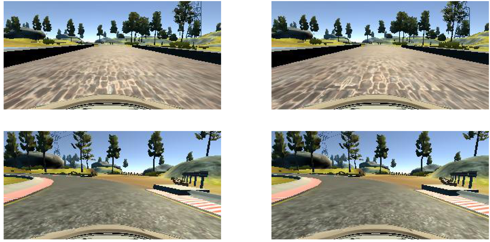
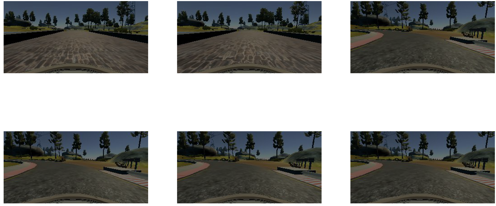
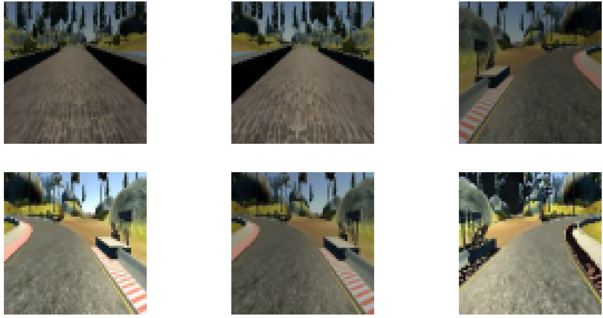

# Use Deep Learning to Clone Driving Behavior

# Objective
This main objective of this project is to train a model which can process image taken by the center camera of the car and can predict the steering angle required for the given throttle value. 


# Input data
We have a simulator which can collect three type of images across the drive. These images include center image from center camera and respectively left and right images from corresponding cameras. 
So as input data we have center,left and right camera images along with the corresponding steering angle for one car driven on track 1 of the simulator. 


```python
plt.figure(figsize=(80,40))
for i in range(4):
    line = data.iloc[[i]].reset_index()
    file = line['center'][0].strip()
    image = cv2.cvtColor(cv2.imread(file),cv2.COLOR_BGR2RGB)
    plt.subplot(2,2,i+1)
    plt.imshow(image)
    plt.axis('off')
plt.show()
```





# Pre-processing
Following pre-processing functions are applied on the images before feeding it to the model-

resize_image - Resize each image by cropping it and remove portion containing useless information like hood of car or top part of trees

add_random_brightness - This is use to add random brightness to incorporate different level of available light situation while capturing pics

flip_image - This is use to flip image which helps in adding more images to training data set

preprocess_image - This uses above function and apply to create final image along with the updated steering wheel angle.


```python
plt.figure(figsize=(80,40))
for i in range(6):
    line = data.iloc[[i]].reset_index()
    file = line['center'][0].strip()
    image = cv2.cvtColor(cv2.imread(file),cv2.COLOR_BGR2RGB)
    image = add_random_brightness(image)
    plt.subplot(2,3,i+1)
    plt.imshow(image)
    plt.axis('off')
plt.show()
```





```python
plt.figure(figsize=(80,40))
for i in range(6):
    line = data.iloc[[i]].reset_index()
    image,angle = preprocess_image(line)
    plt.subplot(2,3,i+1)
    plt.imshow(image)
    plt.axis('off')
plt.show()
```


    <matplotlib.figure.Figure at 0x10d02b828>





# Model
I have trained a multilayer neural network with different types of layers to solve this problem.
I started with a Keras Sequential model with first layer being Lambda layer which take input of 64x64x3 images and do normalization. Layer 2 is a Convolution2D layer with 3 1x1 filter. This layer is followed by ELU,exponential linear unit, activation layer. I used ELU which speeds up learning in deep neural networks and leads to higher classification accuracies, ELUs also avoid a vanishing gradient via the identity for positive values. After this I have one Convolution2D layer with 24 3x3 filter and ELU activation. After this another Convolution2D layer with 48 3x3 filters and ELU activation.
After this I added one max pooling layer with pool size of 2x2,to reduce the size of the problem by introducing sparseness, and a following drop out layer with 0.5 kepp probability. This is followed by another Convolution2D layer with 64 3x3 filters and ELU activation along with max pooling and dropout layer. This is followed by another Convolution2D layer with 128 3x3 filters and ELU activation along with max pooling and dropout layer.
After all of these layers I flatten the output using flatten layer.
After this I added one fully connected NN layer with output dimension of 512 followed by ELU activation and a dropout layer. Similarly I added 3 more fully connected NN layer with different output dimensions. 
Last fully connected NN layer gives one output, steering wheel angle. 

Below you can find input and output of each layer as model summary.


```python
Layer (type)                     Output Shape          Param #     Connected to                     
====================================================================================================
lambda_1 (Lambda)                (None, 64, 64, 3)     0           lambda_input_1[0][0]             
____________________________________________________________________________________________________
conv0 (Convolution2D)            (None, 64, 64, 3)     12          lambda_1[0][0]                   
____________________________________________________________________________________________________
elu_1 (ELU)                      (None, 64, 64, 3)     0           conv0[0][0]                      
____________________________________________________________________________________________________
conv1 (Convolution2D)            (None, 62, 62, 24)    672         elu_1[0][0]                      
____________________________________________________________________________________________________
elu_2 (ELU)                      (None, 62, 62, 24)    0           conv1[0][0]                      
____________________________________________________________________________________________________
conv2 (Convolution2D)            (None, 60, 60, 48)    10416       elu_2[0][0]                      
____________________________________________________________________________________________________
elu_3 (ELU)                      (None, 60, 60, 48)    0           conv2[0][0]                      
____________________________________________________________________________________________________
maxpooling2d_1 (MaxPooling2D)    (None, 30, 30, 48)    0           elu_3[0][0]                      
____________________________________________________________________________________________________
dropout_1 (Dropout)              (None, 30, 30, 48)    0           maxpooling2d_1[0][0]             
____________________________________________________________________________________________________
conv3 (Convolution2D)            (None, 28, 28, 64)    27712       dropout_1[0][0]                  
____________________________________________________________________________________________________
elu_4 (ELU)                      (None, 28, 28, 64)    0           conv3[0][0]                      
____________________________________________________________________________________________________
maxpooling2d_2 (MaxPooling2D)    (None, 14, 14, 64)    0           elu_4[0][0]                      
____________________________________________________________________________________________________
dropout_2 (Dropout)              (None, 14, 14, 64)    0           maxpooling2d_2[0][0]             
____________________________________________________________________________________________________
conv4 (Convolution2D)            (None, 12, 12, 128)   73856       dropout_2[0][0]                  
____________________________________________________________________________________________________
elu_5 (ELU)                      (None, 12, 12, 128)   0           conv4[0][0]                      
____________________________________________________________________________________________________
maxpooling2d_3 (MaxPooling2D)    (None, 6, 6, 128)     0           elu_5[0][0]                      
____________________________________________________________________________________________________
dropout_3 (Dropout)              (None, 6, 6, 128)     0           maxpooling2d_3[0][0]             
____________________________________________________________________________________________________
flatten_1 (Flatten)              (None, 4608)          0           dropout_3[0][0]                  
____________________________________________________________________________________________________
conn1 (Dense)                    (None, 512)           2359808     flatten_1[0][0]                  
____________________________________________________________________________________________________
elu_6 (ELU)                      (None, 512)           0           conn1[0][0]                      
____________________________________________________________________________________________________
dropout_4 (Dropout)              (None, 512)           0           elu_6[0][0]                      
____________________________________________________________________________________________________
conn2 (Dense)                    (None, 128)           65664       dropout_4[0][0]                  
____________________________________________________________________________________________________
elu_7 (ELU)                      (None, 128)           0           conn2[0][0]                      
____________________________________________________________________________________________________
dropout_5 (Dropout)              (None, 128)           0           elu_7[0][0]                      
____________________________________________________________________________________________________
conn3 (Dense)                    (None, 64)            8256        dropout_5[0][0]                  
____________________________________________________________________________________________________
elu_8 (ELU)                      (None, 64)            0           conn3[0][0]                      
____________________________________________________________________________________________________
dropout_6 (Dropout)              (None, 64)            0           elu_8[0][0]                      
____________________________________________________________________________________________________
conn4 (Dense)                    (None, 16)            1040        dropout_6[0][0]                  
____________________________________________________________________________________________________
elu_9 (ELU)                      (None, 16)            0           conn4[0][0]                      
____________________________________________________________________________________________________
dropout_7 (Dropout)              (None, 16)            0           elu_9[0][0]                      
____________________________________________________________________________________________________
output (Dense)                   (None, 1)             17          dropout_7[0][0]                  
====================================================================================================
Total params: 2,547,453
Trainable params: 2,547,453
Non-trainable params: 0
____________________________________________________________________________________________________
```

# Compiling the model and training
I am using adam optimizer and mean squared error for compiling the model. Once model is compiled I am using fit_generator for training and validation set to save memory by not loading all images at same time. I am using 50 epoch with sample per epoch =  200*256. Validation set size is 1000.


```python
#Compile model using Adam optimizer
model.compile("adam", "mse")
# New size of images
new_col, new_row = 64, 64
# Batch size to be processed
batch_size = 256
# Validation set size
val_size = 1000

# Training model here using fit_generator to save memory by not loading all images at same time
history = model.fit_generator(generate_train(data,batch_size),nb_epoch=50,
            samples_per_epoch=batch_size*200, validation_data=generate_validate(data),
                        nb_val_samples=val_size)
```


```python

```
I have used help from different Udacity students on Slack channel and there Medium posts for this project. I also referred Nvidia architecture for thid problem.